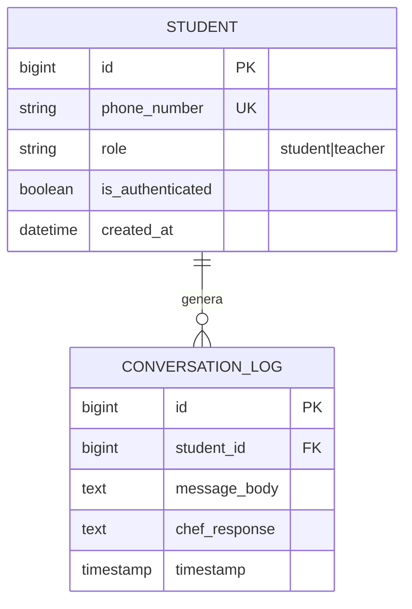
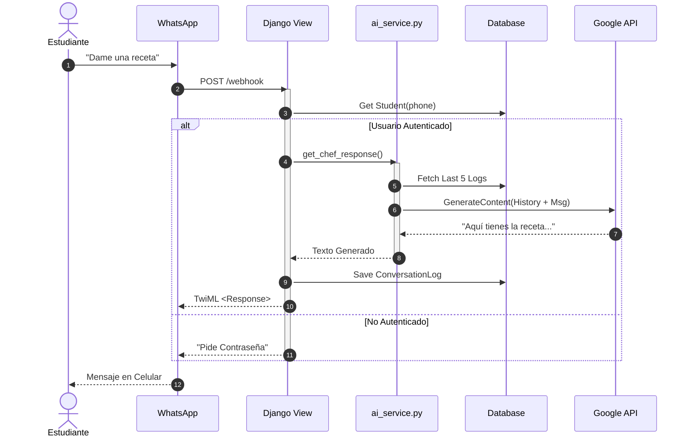
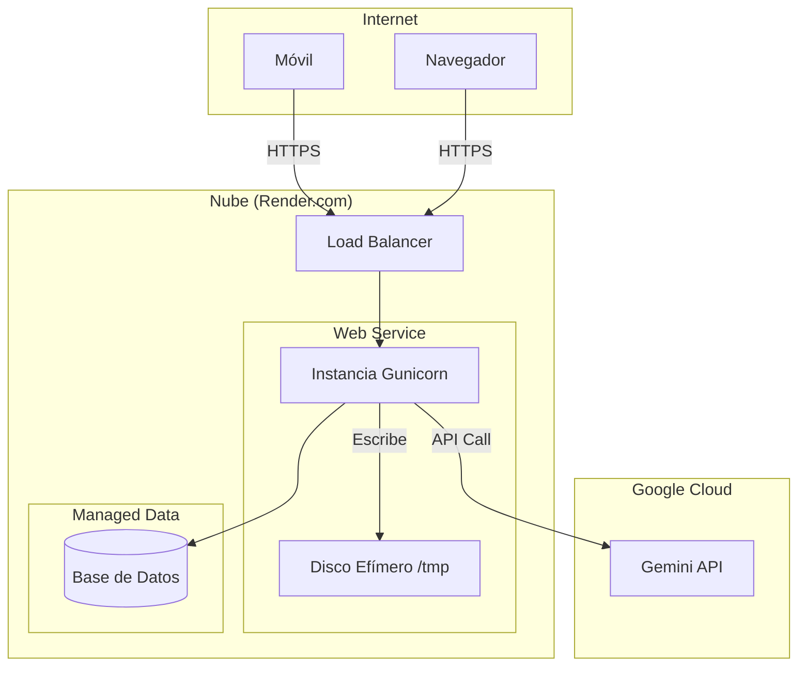

# 🏛️ Especificación de Arquitectura de Software: Ecosistema "Chef Edwin"

**Título Oficial:** Plataforma de Asistencia Educativa Culinaria Basada en Inteligencia Artificial Generativa Multimodal
**Versión del Documento:** 1.0 (first edition)
**Fecha de Emisión:** Diciembre 2025
**Autor:** Carlos Benavides 
**Marco de Referencia:** C4 Model, IEEE 1471 (4+1), ISO/IEC 25010
**Nivel de Acceso:** Uso Corporativo

---

## 📑 Índice Maestro

1.  **Visión y Contexto (Modelo C4)**
2.  **Vista Lógica y de Datos (ERD)**
3.  **Vista de Procesos (Flujos Dinámicos)**
4.  **Vista de Desarrollo y Decisiones (ADR)**
5.  **Vista Física e Infraestructura**
6.  **Requisitos y Niveles de Servicio (SLA)**
7.  **Gestión de Riesgos y Seguridad**
8.  **Evolución Futura**

---

## 1. Visión y Contexto (Modelo C4)

### 1.1 Resumen Ejecutivo
Chef Edwin es una plataforma de **Tutoría Culinaria Inteligente** implementada como un sistema web en Python. Utiliza la API de **Google Gemini** para proveer retroalimentación educativa inmediata a estudiantes a través de **WhatsApp**, actuando como un intermediario inteligente que procesa texto, audio e imágenes.

### 1.2 Diagrama de Contexto (Nivel 1)

Diagrama de Contexto Chef Edwin
)

### 1.3 Diagrama de Contenedores (Nivel 2 - Realidad V1)
Refleja estrictamente el código desplegado actual: Monolito Django.

## 2. Vista Lógica y de Datos (ERD)

### 2.1 Modelo de Datos Actual
Esquema relacional implementado en `assistant/models.py`.

---

## 3. Vista de Procesos (Flujos Dinámicos)

### 3.1 Modelo de Concurrencia (Síncrono)
Actualmente, el sistema opera con **Workers Síncronos** (Gunicorn).
1.  WhatsApp envía mensaje.
2.  Worker de Django recibe petición.
3.  Worker llama a Gemini (Espera ~3-5s).
4.  Worker guarda en BD.
5.  Worker responde a WhatsApp.
*Nota: Este modelo requiere configurar `timeout` alto en Gunicorn para evitar errores con imágenes pesadas.*

### 3.2 Diagrama de Secuencia: Flujo Real V1

---

## 4. Vista de Desarrollo y Decisiones (ADR)

### 4.1 Stack Tecnológico Implementado
*   **Backend:** Python 3.11 + Django 5.2.
*   **Servidor Web:** Gunicorn (Producción - Render) / Runserver (Dev).
*   **Base de Datos:** PostgreSQL con `dj-database-url`.
*   **IA:** `google-generativeai` SDK.
*   **Archivos:** Sistema de archivos efímero (`/tmp`) para descargas temporales de audio/imagen.

### 4.2 Registro de Decisiones Arquitectónicas (ADR)

| ID | Título | Contexto | Decisión | Consecuencia |
| :--- | :--- | :--- | :--- | :--- |
| **ADR-01** | **Django vs Microframeworks** | Necesidad de MVP rápido con Admin. | **Usar Django.** | Mayor tamaño de imagen Docker, pero Admin Panel gratis. |
| **ADR-02** | **Procesamiento Síncrono** | Complejidad de colas (Redis). | **Mantener síncrono en V1.** | Simplicidad de despliegue. Riesgo de timeout en audios largos (mitigable con timeouts altos). |
| **ADR-03** | **Gemini Multimodal** | Transcripción de Audio. | **Usar Gemini nativo.** | Ahorra integrar Whisper/Deepgram. Dependencia fuerte de Google. |

---

## 5. Vista Física e Infraestructura

### 5.1 Diagrama de Despliegue (Render PaaS)

---

## 6. Requisitos Implementados

### 6.1 Funcionalidades Actuales
*   **RF-01:** Webhook compatible con Twilio para Texto, Imagen y Audio.
*   **RF-02:** Autenticación básica por contraseña (campo `is_authenticated` en BD).
*   **RF-03:** Diferenciación de Roles (Prompt de Profesor vs Estudiante).
*   **RF-04:** Historial de conversación persistente en PostgreSQL.

### 6.2 SLAs Actuales
*   **Latencia Promedio:** 3-6 segundos (dependiente de API Google).
*   **Disponibilidad:** Dependiente de Render Free/Starter Tier.

---

## 7. Gestión de Riesgos Actuales

| Riesgo | Estado | Mitigación en Código |
| :--- | :--- | :--- |
| **Timouts de Webhook** | Activo | El código optimiza las descargas de medios. Si Google tarda >15s, Twilio falla. |
| **Alucinaciones** | Mitigado | Prompt del sistema (System Prompt) incluye instrucciones de seguridad alimentaria. |
| **Costos API** | Monitorizado | Uso de modelo `gemini-flash` para minimizar costos. |

---

## 8. Evolución Futura (Roadmap)

Tecnologías consideradas para futuras versiones (No implementadas aún):
*   **V2:** Tablas de Perfil y Gamificación.
*   **V3:** Colas de tareas para evitar timeouts en audios largos.
*   **V4:** Interfaz Web React separada.

---
**Firma de Aprobación Técnica:**
*CarlosBena Chef Edwin - V1.0*
